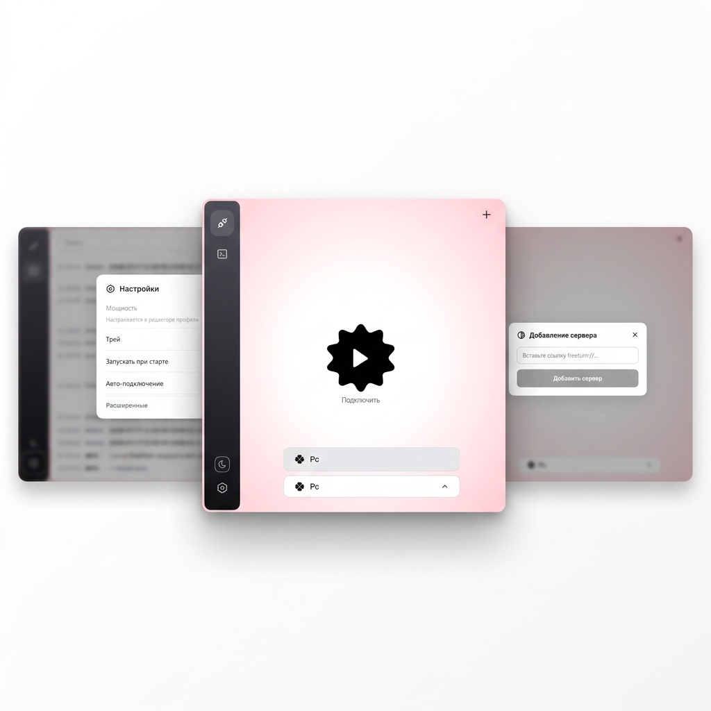

<p align="center">
  
</p>

<h1 align="center">FTurnPc</h1>

<p align="center">
  Десктопный VPN-клиент для Windows, который туннелирует трафик через TURN-серверы VK,<br>
  маскируя соединение под зашифрованный медиатрафик звонка.<br>
  <sub>Версия для ПК на базе Wails и ядра FreeTurn от <a href="https://github.com/samosvalishe">samosvalishe</a></sub>
</p>

<p align="center">
  
  
  
</p>

---

## Как это работает

Приложение запускает фоновый процесс `freeturnclient`, который поднимает туннель на локальном адресе `127.0.0.1:9000`. Приложение создаёт системный виртуальный сетевой интерфейс WireGuard (wg-turn) и перенаправляет весь системный интернет-трафик в этот туннель. 

Все пакеты упаковываются в RTP-медиапотоки с шифрованием и передаются на TURN-серверы VK. С точки зрения провайдера ваше соединение выглядит как обычный групповой звонок VK.

```
Системный трафик → WireGuard (wg-turn) → FTurn Client (127.0.0.1:9000) → RTP/DTLS (Внешний интернет) → VK TURN → Ваш VPS (freeturn-server)
```

Приложение имеет защиту от зацикливания маршрутов: IP-адреса серверов VK и TURN динамически определяются из логов соединения на старте и добавляются в системную таблицу исключений Windows, чтобы служебный трафик обходил туннель напрямую.

---

## Основные возможности

* **Минималистичный дизайн Cobalt**: Интерфейс приложения полностью стилизован под дизайн-систему популярного медиа-загрузчика [cobalt](https://github.com/imputnet/cobalt) — монохромная плоская палитра, моноширинный шрифт IBM Plex Mono и аккуратные скругления без эффектов стекла.
* **Мониторинг трафика в реальном времени**: Под кнопкой подключения отображается текущая скорость скачивания/отдачи и общий объём принятых/переданных данных.
* **Обход российских ресурсов (Bypass RU)**:
  * Включение/выключение в настройках.
  * Файл `geoip-ru.txt` поддерживает IP-подсети (CIDR), одиночные IP, а также доменные имена и URL (например, `ya.ru`, `2ip.io`, `gosuslugi.ru`). Домены разрешаются в IP-адреса асинхронно на старте.
  * Применение тысяч маршрутов обхода выполняется пакетно в один шаг с помощью `netsh -f`, что исключает зависание компьютера на старте.
* **Режим разработчика в настройках профиля**:
  * Обычному пользователю видны только настройки ссылки звонка и количества потоков.
  * Чекбокс **«Режим разработчика»** открывает для просмотра и редактирования все системные поля (Peer, Provider, Transport, Obf Profile, Obf Key, Client ID и конфигурацию WireGuard).
* **Синхронизированный выход**: Полное завершение фонового процесса `freeturnclient` при закрытии из трея (без зависания зомби-процессов).


---

## Структура папки приложения

При портативном использовании приложение должно быть расположено в одной папке с необходимыми компонентами:

```
bin/
├── FTurnPc.exe            # Интерфейс приложения (этот клиент)
├── freeturnclient.exe     # Клиентское ядро (из репозитория free-turn-proxy)
├── wintun.dll             # Драйвер WireGuard (автоматически извлекается нужной разрядности)
└── geoip-ru.txt           # Список доменов/подсетей для пуска в обход туннеля
```

> [!NOTE]
> Клиентское ядро **`freeturnclient.exe`** необходимо скачать отдельно из репозитория [free-turn-proxy от samosvalishe](https://github.com/samosvalishe/free-turn-proxy) и положить в ту же папку, где находится `FTurnPc.exe` (или в `build/bin/` перед сборкой установщика).

---

## Быстрый старт (Windows)

1. Запустите `FTurnPc.exe` **от имени администратора** (необходимо для создания интерфейса WireGuard и настройки таблиц маршрутизации).
2. Добавьте сервер кнопкой `+`, вставив конфигурационную ссылку.
3. Нажмите на шестерёнку настроек профиля для изменения количества потоков или ссылки.
4. Нажмите кнопку питания по центру для активации туннеля.

---

## Формат ссылки

Приложение принимает конфигурационные ссылки в следующем формате:

```
freeturn://<Base64-encoded-JSON> -links "https://vk.ru/call/join/9GLAhfKE5..."
```

* **`freeturn://<Base64-строка>`** — содержит закодированный JSON-объект с настройками обфускации, ключами и конфигурацией WireGuard.
* **`-links "<ссылка_на_звонок_vk>"`** — указывает ссылку на активный звонок VK, используемый для авторизации.

Декодированный JSON-объект настроек имеет следующую структуру:
```json
{
  "name": "Название сервера",
  "provider": "vk",
  "peer": "IP:порт_TURN_сервера",
  "transport": "udp",
  "obf": "rtpopus...",
  "key": "ключ_обфускации",
  "cid": "client_id",
  "wg": "[Interface]\nPrivateKey = ...\nAddress = 10.0.0.2/24\n...\n[Peer]\nPublicKey = ...\nAllowedIPs = 0.0.0.0/0"
}
```

Ссылку можно добавить как через меню `+`, так и просто нажав **Ctrl+V** в любом месте окна приложения.

---

## Сборка из исходников

Приложение кросс-компилируется и автоматически внедряет нужную разрядность драйвера `wintun.dll` (32-бит или 64-бит) благодаря условным тегам сборки.

**Требования:** Go 1.26+, Node.js 22+, Wails v2.

```bash
# Клонирование репозитория
git clone https://github.com/LiTarPc/FTurnPc.git
cd FTurnPc

# Сборка 64-битной версии (рекомендуется)
wails build -platform windows/amd64

# Сборка 32-битной версии (legacy)
wails build -platform windows/386
```

---

## Создание инсталлятора (NSIS)

Вы можете собрать дистрибутив в виде единого установочного EXE-файла, который содержит в себе все ресурсы, предлагает выбор папки установки и создаёт ярлыки:

1. Установите **NSIS** на компьютер: [https://nsis.sourceforge.io/](https://nsis.sourceforge.io/)
2. Добавьте путь к папке NSIS (например, `C:\Program Files (x86)\NSIS`) в системную переменную `PATH`.
3. Запустите сборку:
   ```bash
   wails build -platform windows/amd64 -nsis
   ```
4. Готовый инсталлятор будет лежать в папке **`build/bin/FTurnPc-amd64-installer.exe`**.

---

> [!IMPORTANT]
> Приложение является техническим инструментом для защищённого туннелирования собственного трафика через ваш личный TURN-сервер. Пожалуйста, используйте его исключительно в законных целях.

## Лицензия

Этот проект распространяется под лицензией GNU General Public License v3.0.
