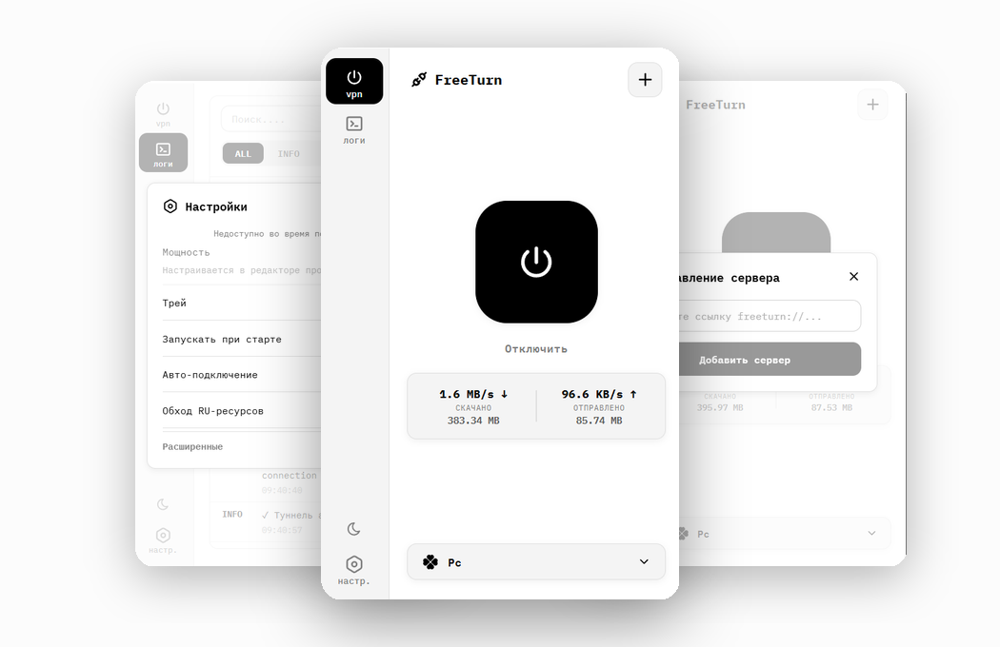

<p align="center">
  
</p>

<h1 align="center">FTurnPc</h1>

<p align="center">
  Десктопный VPN-клиент для Windows, который туннелирует трафик через TURN-серверы VK,<br>
  маскируя соединение под зашифрованный медиатрафик звонка.<br>
  <sub>Версия для ПК на базе ядра FreeTurn от <a href="https://github.com/samosvalishe">samosvalishe</a></sub>
</p>

<p align="center">
  
  
  
</p>

---

## Как это работает

Приложение запускает фоновый процесс `freeturnclient`, который поднимает туннель на локальном адресе `127.0.0.1:9000`. Приложение создаёт системный виртуальный сетевой интерфейс WireGuard (wg-turn) и перенаправляет весь системный интернет-трафик в этот туннель. 

Все пакеты упаковываются в RTP-медиапотоки с шифрованием и передаются на TURN-серверы VK. С точки зрения провайдера ваше соединение выглядит как обычный групповой звонок VK.

```
Системный трафик → WireGuard (wg-turn) → FTurn Client (127.0.0.1:9000) → RTP/DTLS (Внешний интернет) → Ваш VPS (freeturn-server)
```

---

## Основные возможности

* **Минималистичный дизайн Cobalt**: Интерфейс приложения полностью стилизован под дизайн-систему популярного медиа-загрузчика [cobalt](https://github.com/imputnet/cobalt) — монохромная плоская палитра, моноширинный шрифт IBM Plex Mono и аккуратные скругления без эффектов стекла.
* **Мониторинг трафика в реальном времени**: Под кнопкой подключения отображается текущая скорость скачивания/отдачи и общий объём принятых/переданных данных.
* **Обход российских ресурсов (Bypass RU)**:
  * Включение/выключение в настройках.
  * Файл `geoip-ru.txt` поддерживает IP-подсети (CIDR), одиночные IP, а также доменные имена и URL (например, `ya.ru`, `2ip.io`, `gosuslugi.ru`). Домены разрешаются в IP-адреса асинхронно на старте.
  * Применение тысяч маршрутов обхода выполняется пакетно в один шаг с помощью `netsh -f`, что исключает зависание компьютера на старте.
* **Режим разработчика в настройках**:
  * Переключатель **«Режим разработчика»** скрывает системные опции от обычного пользователя и открывает доступ к точной настройке параметров пароль вхардкожен **admin123**.
  * **Автоматический MTU & TCP MSS Clamping**: Настройка MTU в режиме разработчика принудительно задаёт субинтерфейсный MTU в сетевом стеке Windows (`netsh interface ipv4 set subinterface "wg-turn" mtu=... store=active`). Это автоматически рассчитывает и зажимает максимальный размер сегмента TCP SYN пакетов (`TCP MSS = MTU - 40`), предотвращая фрагментацию и сброс соединений в играх и приложениях.
  * **Встроенная диагностика STUN NAT**: Диагностический модуль на базе RFC 3489 / RFC 5389 классифицирует тип NAT соединения (*Full Cone NAT*, *Restricted Cone NAT*, *Symmetric NAT* или *UDP Blocked*), позволяя быстро выявлять причины проблем с P2P и сетевыми играми.
* **Поддержка игровых ретрансляторов (Valve SDR / CS2 / Dota 2)**: Автоматическая регистрация правил в брандмауэре Windows (`FTurn_ICMP_In`), пропускающих входящие сообщения `ICMP Port Unreachable` от кластеров Valve SDR. Это решает проблему со статусом «Задержка: ОШИБКА» в Dota 2 и CS2.
* **Синхронизированный выход**: Полное завершение фонового процесса `freeturnclient` при закрытии из трея (без зависания зомби-процессов).


---

## Структура папки приложения

При портативном использовании приложение должно быть расположено в одной папке с необходимыми компонентами:

```
bin/
├── FTurnPc.exe            # Интерфейс приложения (этот клиент)
├── freeturnclient.exe     # Клиентское ядро (из репозитория free-turn-proxy)
├── wintun.dll             # Драйвер WireGuard (автоматически извлекается нужной разрядности)
└── geoip-ru.txt           # Список доменов/подсетей для пуска в обход туннеля
```

> [!NOTE]
> Клиентское ядро **`freeturnclient.exe`** необходимо скачать отдельно из репозитория [free-turn-proxy от samosvalishe](https://github.com/samosvalishe/free-turn-proxy) и положить в ту же папку, где находится `FTurnPc.exe` (или в `build/bin/` перед сборкой установщика).

---

## Быстрый старт (Windows)

1. Запустите `FTurnPc.exe` **от имени администратора** (необходимо для создания интерфейса WireGuard и настройки таблиц маршрутизации).
2. Добавьте сервер кнопкой `+`, вставив конфигурационную ссылку.
3. Нажмите на шестерёнку настроек профиля для изменения количества потоков или ссылки.
4. Нажмите кнопку питания по центру для активации туннеля.

---

## Формат ссылки

Приложение принимает конфигурационные ссылки в двух вариантах:

**Вариант 1 (Явный, с открытой ссылкой VK):**
```
freeturn://<Base64-encoded-JSON> -links "https://vk.ru/call/join/9GLAhfKE5..."
```
Здесь ссылка на звонок передаётся открытым текстом после аргумента `-links`.

**Вариант 2 (Скрытый, ссылка внутри JSON):**
```
freeturn://<Base64-encoded-JSON>
```
В этом случае ссылка на звонок не видна снаружи, так как она передаётся напрямую внутри JSON-объекта в поле `"links"`. Это отлично подходит для ботов, когда вы хотите скрыть визуальный вид ссылки от пользователей.

* **`freeturn://<Base64-строка>`** — содержит закодированный JSON-объект с настройками обфускации, ключами и конфигурацией WireGuard.

Декодированный JSON-объект настроек имеет следующую структуру:
```json
{
  "name": "Название сервера",
  "provider": "vk",
  "peer": "IP:порт_TURN_сервера",
  "transport": "udp",
  "links": "https://vk.ru/call/join/9GLAhfKE5...",
  "obf": "настройки_обфускации",
  "key": "ключ_обфускации",
  "cid": "client_id",
  "wg": "[Interface]\nPrivateKey = ...\nAddress = 10.0.0.2/24\n...\n[Peer]\nPublicKey = ...\nAllowedIPs = 0.0.0.0/0"
}
```

Ссылку можно добавить как через меню `+`, так и просто нажав **Ctrl+V** в любом месте окна приложения.

---

## Сборка из исходников

**Требования:** Go 1.26+, Node.js 22+, Wails v2.

### Сборка под Windows:
```bash
# Сборка 64-битной версии (рекомендуется)
wails build -platform windows/amd64 -o FTrunPc.exe

# Сборка 32-битной версии (legacy)
wails build -platform windows/386 -o FTrunPc.exe
```

### Сборка под Linux:
Установите системные зависимости перед сборкой:

* **Ubuntu / Debian:**
  ```bash
  sudo apt update && sudo apt install -y build-essential gcc pkg-config libgtk-3-dev webkit2gtk-4.1-dev libayatana-appindicator3-dev wireguard-tools
  ```
* **Arch Linux / Manjaro:**
  ```bash
  sudo pacman -S base-devel pkgconf gtk3 webkit2gtk-4.1 libayatana-appindicator wireguard-tools
  ```
* **Fedora / RHEL:**
  ```bash
  sudo dnf install -y gcc pkg-config gtk3-devel webkit2gtk4.1-devel libayatana-appindicator-devel wireguard-tools
  ```

Команда сборки:
```bash
wails build -platform linux/amd64 -tags webkit2_41 -o FTrunPc
```

---

## Создание инсталлятора (NSIS)

Вы можете собрать дистрибутив в виде единого установочного EXE-файла, который содержит в себе все ресурсы, предлагает выбор папки установки и создаёт ярлыки:

1. Установите **NSIS** на компьютер: [https://nsis.sourceforge.io/](https://nsis.sourceforge.io/)
2. Добавьте путь к папке NSIS (например, `C:\Program Files (x86)\NSIS`) в системную переменную `PATH`.
3. Запустите сборку:
   ```bash
   wails build -platform windows/amd64 -nsis
   ```
4. Готовый инсталлятор будет лежать в папке **`build/bin/FTurnPc-amd64-installer.exe`**.

---

> [!IMPORTANT]
> Приложение является техническим инструментом для защищённого туннелирования собственного трафика через ваш личный TURN-сервер. Пожалуйста, используйте его исключительно в законных целях.

## Лицензия

Этот проект распространяется под лицензией GNU General Public License v3.0.
